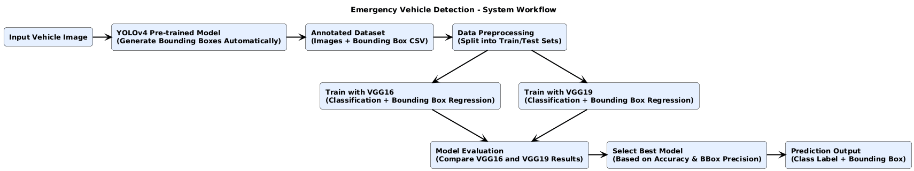
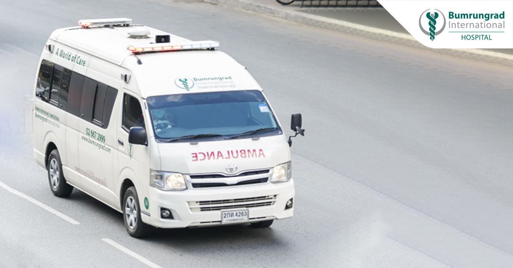
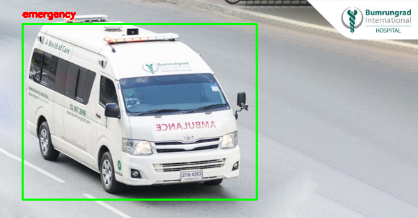

# Emergency Vehicle Detection  

## Overview  
We developed this project to detect and classify **emergency vehicles** such as ambulances and fire trucks, as well as **non-emergency vehicles** like cars and buses.  
The main objective was to design a deep learning system capable of both identifying the vehicle type and drawing **bounding boxes** around the detected objects in an image.  

Our system contributes to **intelligent transportation** and **smart city applications**, where recognizing emergency vehicles quickly is important for improving traffic flow and safety.

---

## Motivation  
During our initial research, we found that most available datasets for emergency vehicles lacked bounding box annotations.  
To overcome this limitation, we designed a workflow that could automatically generate bounding boxes and evaluate multiple CNN architectures for detection and classification tasks.  
This approach allowed us to explore different methods and understand which performed best for this problem.

---

## Dataset and Preprocessing  
We used the **[Emergency Vehicles Identification Dataset](https://www.kaggle.com/abhisheksingblr/emergency-vehicles-identification)** from Kaggle.  
Although the dataset contained labeled vehicle images, it did not include bounding box information.  
To handle this, we applied a **YOLOv4 pre-trained model** (trained on MS COCO) to automatically generate bounding boxes for all images.  

After generating annotations, the dataset was divided into:
- **Training:** 80%  
- **Testing:** 20%  

All coordinates and labels were stored in CSV format for later use during model training and evaluation.

---

## System Workflow  

The overall workflow followed in this project is shown below.

---

## Methodology  

### Data Preparation  
We used YOLOv4 to automatically generate bounding boxes for every image.  
The **Darknet** framework was employed, and the `image.c` file was modified slightly to adapt to our dataset.  
This automation saved significant time and ensured consistency across annotations.  

### Model Architecture  
Two deep convolutional neural network architectures were used in our experiments: **VGG16** and **VGG19**.  
Both models were implemented using **TensorFlow/Keras**.  
Each model was trained to produce two outputs:
1. **Class label** – identifying whether the vehicle is emergency or non-emergency  
2. **Bounding box coordinates** – specifying the location of the detected vehicle  

### Training Setup  
Our models were trained using a dual-loss setup:
- **Classification loss** for identifying vehicle type  
- **Bounding box regression loss** for localization accuracy  

Different normalization combinations were tested, including **batch normalization** and **layer normalization**.  
Each configuration was trained for **25, 100, and 250 epochs** to evaluate performance over time.  
All experiments were run on the same data splits to ensure a fair comparison between architectures.

### Implementation  
We monitored model accuracy and loss throughout training.  
Graphs of both metrics were generated to observe convergence and detect potential overfitting.  
This helped in deciding the ideal number of epochs and normalization strategy for each model.

---

## Experimental Setup  
**Frameworks and Libraries:** TensorFlow, Keras, OpenCV, NumPy, Pandas  
**Hardware:** GPU-supported environment  
**Input Format:** .jpg / .png images  
**Output Format:** Class label and bounding box coordinates  

---

## Results and Observations  

Our experiments focused on comparing **VGG16** and **VGG19** architectures based on classification accuracy and bounding box precision.  
The main goal was to understand how normalization and training duration affected model performance.

### VGG16 Results  

| Setup | Epochs | Layer Norm | Batch Norm | Class Accuracy | BBox Accuracy | Remarks |
|:------|:-------:|:-----------:|:------------:|:----------------:|:----------------:|:---------|
| 1 | 25 | Yes | Yes | 0.7957 | 0.8516 | Normalization improved stability. |
| 2 | 25 | No | Yes | **0.8022** | **0.8645** | Best configuration overall. |
| 3 | 25 | No | No | 0.8022 | 0.8580 | Slightly less accurate bounding boxes. |
| 4 | 100 | No | Yes | 0.7957 | 0.8516 | Accuracy plateaued after 100 epochs. |
| 5 | 250 | No | Yes | 0.8022 | 0.8215 | Overfitting observed after long training. |

**Observation:**  
The **VGG16 model** performed best when only **batch normalization** was applied.  
It achieved approximately **80% classification accuracy** and **86% bounding box accuracy**.  
Longer training beyond 100 epochs did not improve results and slightly reduced generalization.

---

### VGG19 Results  

| Setup | Epochs | Batch Norm | Class Accuracy | BBox Accuracy | Remarks |
|:------|:-------:|:-------------:|:----------------:|:----------------:|:----------|
| 1 | 25 | No | 0.7591 | 0.8215 | Base configuration. |
| 2 | 25 | Yes | 0.7376 | 0.8236 | Improved stability, slightly weaker classification. |
| 3 | 100 | Yes | 0.7613 | 0.8193 | Gradual improvement. |
| 4 | 250 | Yes | 0.7742 | **0.8280** | Highest bounding box precision after extended training. |

**Observation:**  
The **VGG19 model** achieved up to **82.8% bounding box accuracy** and **77.4% classification accuracy** when trained for 250 epochs.  
Although bounding box localization improved slightly, the training time and computational cost were considerably higher.

---

### Comparative Summary  

| Metric | VGG16 (Best) | VGG19 (Best) | Comment |
|:--------|:--------------:|:--------------:|:----------|
| Epochs | 25 | 250 | VGG16 converged faster. |
| Classification Accuracy | **0.802** | 0.774 | VGG16 classified vehicles more accurately. |
| Bounding Box Accuracy | **0.864** | 0.828 | VGG16 achieved stronger localization. |
| Computational Cost | Low | High | VGG16 required fewer resources. |

**Discussion:**  
Based on the comparison, **VGG16** demonstrated the best balance between accuracy, speed, and computational efficiency.  
The **VGG19** model required significantly longer training and showed minor improvement in bounding box precision.  
As a result, our final deployment model was built using **VGG16**.

---

## Example Outputs  

The following examples illustrate how the final system performs on test images.

  
  

In the output, the model correctly detects the emergency vehicle and highlights it with a bounding box.

---

## Conclusion and Future Work  
The developed system successfully detects and classifies emergency vehicles using convolutional neural networks.  
Among the models tested, **VGG16** offered the best trade-off between training stability, accuracy, and computation time.  
Our findings indicate that CNN-based models can effectively handle this type of multi-output detection problem.  

In future work, we plan to:
- Integrate **YOLOv8** or **Detectron2** for real-time detection and tracking.  
- Expand the dataset with **manually annotated bounding boxes** for improved precision.  
- Deploy the model in a **real-time traffic camera environment** to evaluate system performance under live conditions.

---

## References  

1. PyImageSearch Tutorial – *Multi-Class Object Detection with Keras and TensorFlow*  
   [https://www.pyimagesearch.com/2020/10/12/multi-class-object-detection-and-bounding-box-regression-with-keras-tensorflow-and-deep-learning/](https://www.pyimagesearch.com/2020/10/12/multi-class-object-detection-and-bounding-box-regression-with-keras-tensorflow-and-deep-learning/)  
2. YouTube Overview – [https://www.youtube.com/watch?v=mjk4vDYOwq0](https://www.youtube.com/watch?v=mjk4vDYOwq0)  
3. YOLOv4 Implementation – based on the Darknet framework (MS COCO pre-trained).  

---

## Contributors  
- [@Carbodose](https://github.com/Carbodose)  
- [@Safat99](https://github.com/Safat99)  
